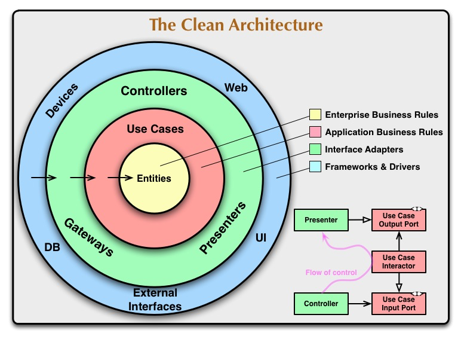

# Clean Architecture

### Architecture Diagram



### Context Architecture

```
└─ context
   └─ organization
      ├─ application
      │  ├─ model
      │  │  ├─ command
      │  │  │  ├─ TeamSearchCommand.java
      │  │  │  └─ MemberSearchCommand.java
      │  │  └─ result
      │  │     ├─ TeamResult.java
      │  │     └─ MemberResult.java
      │  └─ service
      │     ├─ TeamService.java
      │     ├─ TeamRestService.java
      │     ├─ MemberService.java
      │     └─ MemberRestService.java
      ├─ domain
      │  ├─ model
      │  │  ├─ Team.java
      │  │  ├─ Member.java
      │  │  └─ Members.java
      │  ├─ service
      │  │  ├─ MemberJoinTeamService.java
      │  │  ├─ MemberLeaveTeamService.java
      │  │  └─ TeamMergeService.java
      │  └─ repository
      │     ├─ TeamRepository.java
      │     └─ MemberRepository.java  
      ├─ infrastructure
      │  ├─ model
      │  │  ├─ TeamEntity.java
      │  │  └─ MemberEntity.java
      │  ├─ persistence
      │  │  ├─ TeamQueryRepository.java
      │  │  ├─ TeamJpaRepository.java
      │  │  ├─ MemberQueryRepository.java
      │  │  └─ MemberJpaRepository.java
      │  └─ repository
      │     ├─ TeamRestRepository.java
      │     └─ MemberRestRepository.java
      └─ presentation
         ├─ model
         │  ├─ request
         │  │  ├─ TeamRequest.java
         │  │  └─ MemberRequest.java
         │  └─ response
         │     ├─ TeamResponse.java
         │     └─ MemberResponse.java
         └─ controller
            ├─ TeamController.java
            └─ MemberController.java
```