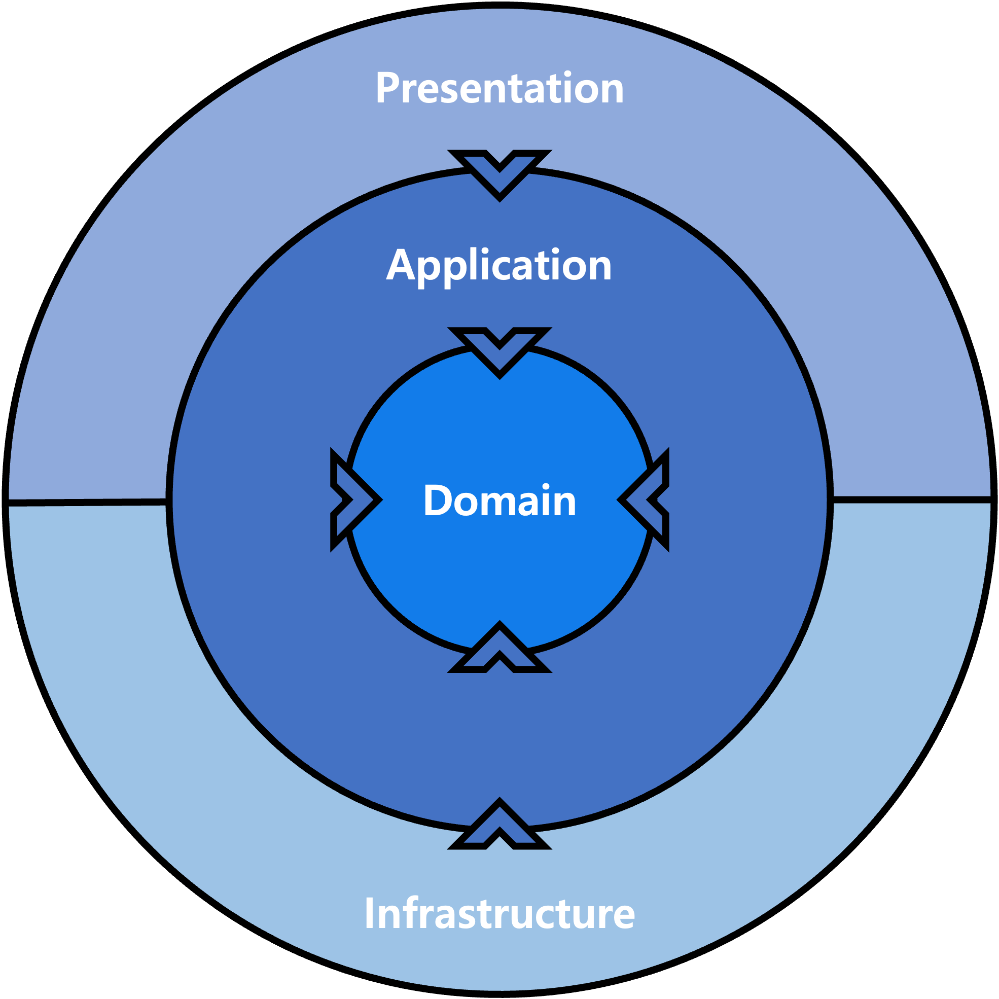

# Clean Architecture

### Package Structure of Clean Architecture

```
├─ config
├─ exception
├─ helper
├─ util
├─ validation
└─ core
   ├─ shared
   ├─ user
   └─ status
      ├─ application
      │  ├─ model
      │  │  ├─ command : method parameter object of service
      │  │  │  ├─ SearchStatusCommand.java
      │  │  │  └─ OperateStatusCommand.java
      │  │  └─ result : return object of service
      │  │     ├─ EmployeeStatusResult.java
      │  │     ├─ DepartmentStatusResult.java
      │  │     └─ CollaboratorStatusResult.java
      │  ├─ service : business logic services of application
      │  │  ├─ StatusService.java : service interface
      │  │  └─ StatusRestService.java implements StatusService
      │  ├─ repository : database access interface
      │  │  └─ StatusRepository.java : interface of repository
      │  └─ adapter : extenal context access interface
      │     └─ StatusEmployeeAdapter.java : interface for adapter
      ├─ domain
      │  ├─ model : core domain models
      │  │  ├─ DailyStatus.java
      │  │  └─ MonthlyStatus.java
      │  └─ logic : business logic utilities of domain
      │     ├─ StatusGenerator.java
      │     └─ StatusCalculator.java
      ├─ infrastructure
      │  ├─ model
      │  │  └─ StatusEntity.java
      │  ├─ repository
      │  │  └─ StatusRestRepository.java implements StatusRepository
      │  ├─ client
      │  └─ adapter 
      │     └─ StatusEmployeeRestAdapter.java implements StatusEmployeeAdapter
      └─ presentation
         ├─ model
         │  ├─ request
         │  │  ├─ SearchMonthlyStatusRequest.java
         │  │  └─ SearchDailyStatusRequest.java
         │  └─ response
         │     ├─ MonthlyStatusResponse.java
         │     └─ DailyStatusResponse.java
         └─ controller
            ├─ EmployeeStatusController.java
            ├─ DepartmentStatusController.java
            └─ CollaboratorStatusController.java
```

### Diagram of Clean Architecture


